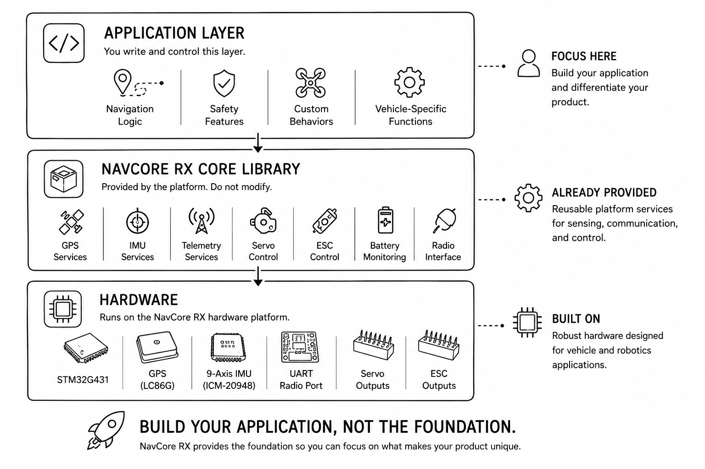

# NavCore RX

NavCore RX is an open vehicle and robotics controller platform built around the STM32G431, GPS, 9-axis IMU, LoRa telemetry, servo outputs, ESC control, and reusable application-layer firmware.

It is designed for builders working on RC vehicles, autonomous boats, rovers, hovercrafts, telemetry platforms, and custom robotics projects.

## Why NavCore RX exists

Most robotics projects spend weeks integrating the same foundation before the real application can begin:

- GPS
- IMU
- Radio communication
- Telemetry
- Battery monitoring
- Servo outputs
- ESC outputs
- Safety logic
- Firmware structure

NavCore RX provides this foundation so builders can focus on the application layer.

## Hardware at a glance

| Component | Part | Purpose |
|---|---|---|
| MCU | STM32G431CBT6 | 170 MHz Cortex-M4 controller |
| IMU | ICM-20948 | Accelerometer, gyroscope, temperature |
| Compass | AK09916 | Tilt-compensated magnetic heading |
| GPS | LC86GLAMD | Position, speed, course, HDOP |
| Radio | E220-900T22D | LoRa telemetry and command link |
| Outputs | Servo + ESC PWM | Vehicle actuator control |

## Firmware structure

The firmware is split into two layers:

| Layer | User action |
|---|---|
| Application Layer | Modify this |
| Core Library | Provided by platform |
| Hardware | Runs on NavCore RX |

Users typically modify:

- `config.h`
- `Servo_Step()`
- `IMU_CheckSafety()`
- application-specific command behavior

The core library handles:

- GPS polling
- IMU reading
- radio send/receive
- motor output
- servo output
- battery monitoring
- telemetry packets
- distance filtering

## Current status

NavCore RX is currently in prototype validation and pre-launch preparation.

Reference firmware is derived from a tested bait boat system. The architecture is designed to support additional applications such as hovercrafts, ground rovers, crop sprayers, balancing robots, and custom RC vehicles.

## Documentation

- [User Guide](docs/NavCore_RX_User_Guide.pdf)
- [Platform Guide](docs/NavCore_RX_Platform_Guide.pdf)

## Example applications

Current reference:

- Bait boat

Planned examples:

- Rover
- Hovercraft
- Crop sprayer
- Custom telemetry vehicle

## What is included now

- Platform documentation
- User guide
- Firmware architecture
- Wiring overview
- Reference bait boat guide
- Roadmap

## What is not released yet

Full production manufacturing files will be released after final validation of the production revision.

## License

Software: MIT License  
Hardware: CERN Open Hardware License v2

## Links

Website: https://synvertexengineering.com  
Product page: https://synvertexengineering.com/products/navcore-rx
